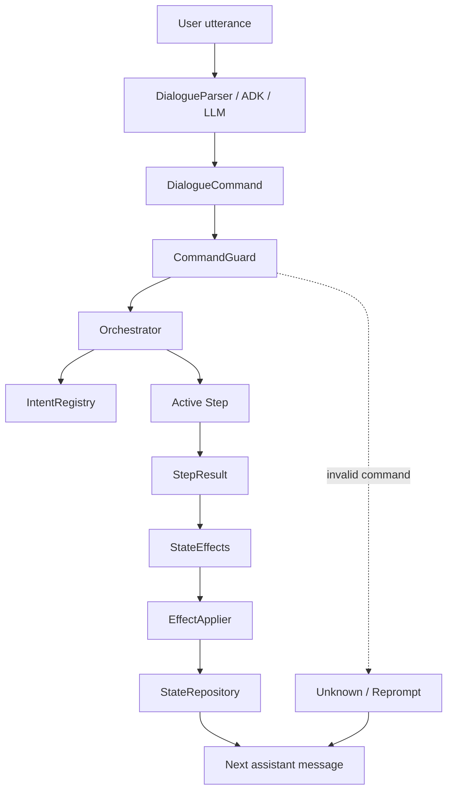
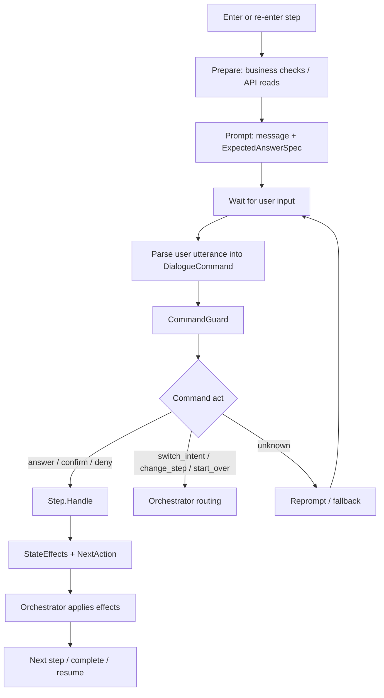
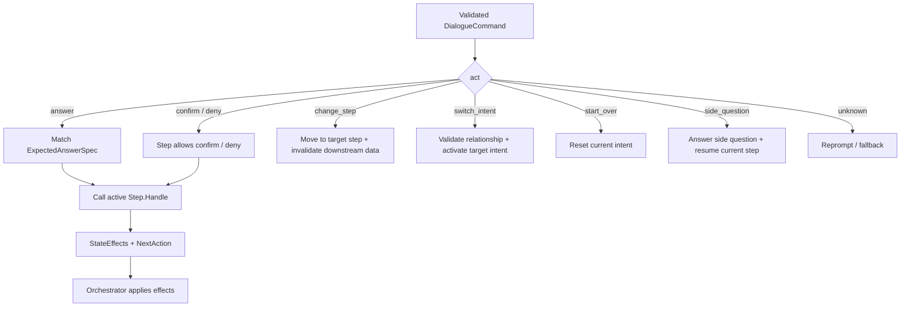
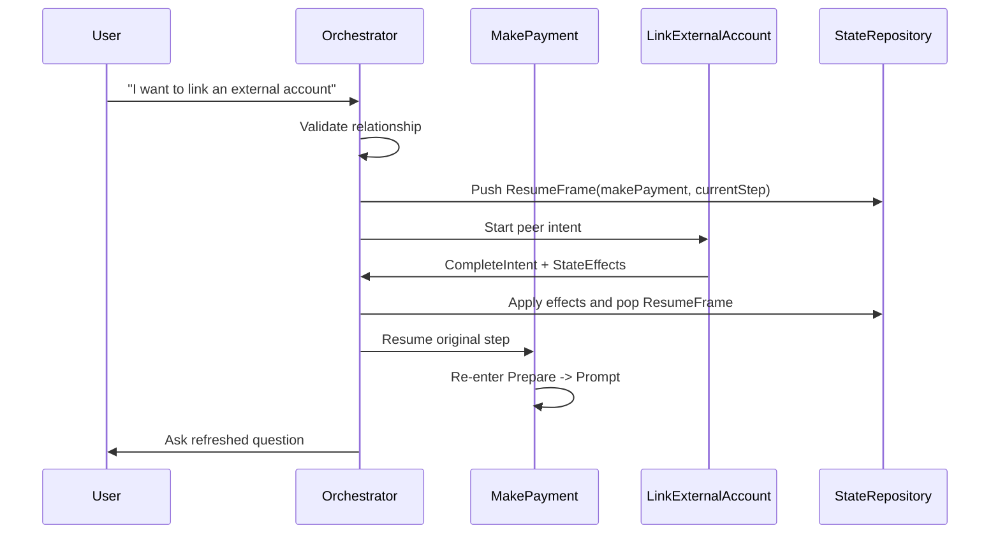
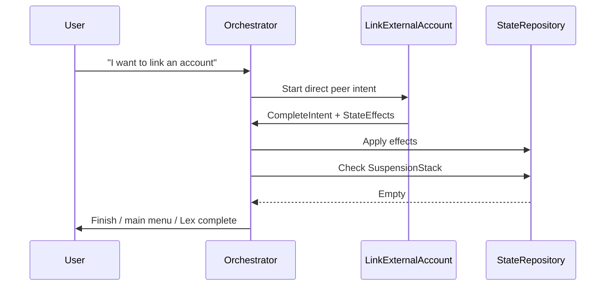
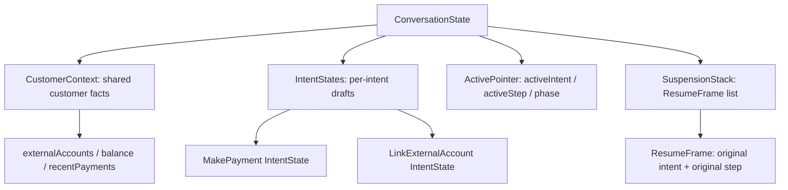
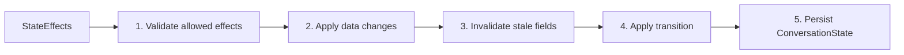

# Intent / Step Orchestration Architecture

## Summary

This design proposes a demo-first, production-shaped architecture for a Go Lambda dialogue orchestrator with multiple peer intents and step-based flows.

The first demo intents are:

- `MakePayment`
- `LinkExternalAccount`

All intents are same-level peer intents. No intent owns another intent. Intents may declare relationships to other intents, and the `Orchestrator` decides whether to switch, resume, or complete.

The LLM is not the flow controller. The LLM only normalizes natural language into a structured `DialogueCommand`. Go code validates the command, routes it, applies state effects, and persists state.

## Key Decisions

| Area | Decision |
| --- | --- |
| Intent model | All intents are peers. No parent/child intent hierarchy. |
| Intent relationship | Intents can declare allowed relationships, such as `MakePayment -> LinkExternalAccount`. |
| Resume behavior | Resume only happens when the Orchestrator has an explicit `ResumeFrame`. |
| Resume target | Resume returns to the original intent and original step. |
| Resume execution | The resumed step re-enters and reruns `Prepare -> Prompt`. |
| LLM responsibility | LLM normalizes user language into `DialogueCommand`. |
| Business validation | `CommandGuard` is the final validator before state mutation. |
| State mutation | Only the `Orchestrator` applies validated `StateEffects`. |
| Step responsibility | Step owns business handling, but never directly mutates state. |
| Global interrupt | At any step, user can ask to change payment method, link account, go back, or start over. |

## Goals

- Support multiple peer intents in the same Lambda dialogue system.
- Allow `MakePayment` to route to `LinkExternalAccount`.
- Allow `LinkExternalAccount` to run directly without returning to `MakePayment`.
- Resume `MakePayment` only if it was explicitly suspended.
- Let users change prior answers at any point.
- Let users link a new account at any point.
- Keep business state mutation deterministic and auditable.
- Keep LLM output constrained to a validated command contract.

## Non-Goals

- Do not make the LLM the flow controller.
- Do not let ADK callbacks mutate business state.
- Do not create parent/child intent ownership.
- Do not store per-customer state in Lambda globals.
- Do not allow state mutation before `CommandGuard` validation.

## High-Level Architecture

```text
User utterance
  -> DialogueParser / ADK / LLM
  -> DialogueCommand
  -> CommandGuard
  -> Orchestrator
  -> Intent / Step
  -> StepResult
  -> StateEffects
  -> EffectApplier
  -> StateRepository
  -> next assistant message
```

## Confluence Diagram Pack

The diagrams below are written in Mermaid. In Confluence, paste each block into a Mermaid macro if available. If Mermaid rendering is not available, keep the section titles and use the tables/text as discussion notes.

### 1. Runtime Architecture



### 2. Step Lifecycle



### 3. Command Routing



### 4. Peer Intent Switch And Resume



### 5. Direct LinkExternalAccount Without Resume



### 6. Conversation State Model



### 7. Effect Apply Order



## Core Components

| Component | Responsibility |
| --- | --- |
| `IntentRegistry` | Registers peer intents and validates allowed intent relationships. |
| `Intent` | Owns step graph, entry step, relationships, resume policy, and completion policy. |
| `Step` | Owns step-level business checks, prompt generation, expected answer spec, and current-answer handling. |
| `DialogueParser` | Uses LLM/ADK to normalize user utterance into `DialogueCommand`. |
| `CommandGuard` | Validates command against current step expectation and intent registry. |
| `Orchestrator` | Loads state, routes commands, calls steps, applies effects, persists state. |
| `EffectApplier` | Applies validated `StateEffects` in a deterministic order. |
| `StateRepository` | Stores and loads durable `ConversationState`. |

## Intent Contract

Each intent defines:

```text
Name
EntryStep
Steps
Relationships
ResumePolicy
CompletionPolicy
```

Intent rules:

- Intent owns its step graph.
- Intent declares relationships to peer intents.
- Intent does not directly mutate conversation state.
- Intent does not call the LLM.
- Intent does not apply state effects.

## Step Contract

Each step defines:

```text
Name
Prepare
Prompt
Handle
ChangePolicy
InvalidationPolicy
```

Step rules:

- `Prepare` runs when entering or re-entering the step.
- `Prompt` uses `Prepare` output to ask a question and create `ExpectedAnswerSpec`.
- `Handle` runs only after a valid current-step answer.
- Step returns `StateEffects` and `NextAction`.
- Step does not directly write state.

## Step Lifecycle

```text
Enter Step
  -> Prepare
  -> Prompt
  -> Wait for user input
  -> Handle valid answer
  -> Return StateEffects + NextAction
```

Important lifecycle rule:

- `Prepare` and `Prompt` run on step entry.
- User answer returns directly to `Handle`.
- If the user is not understood, the system stays in the same step and reprompts.
- If the step is resumed after another intent completes, the step re-enters and reruns `Prepare -> Prompt`.

## State Model

```text
ConversationState
  CustomerContext
  IntentStates
  ActivePointer
  SuspensionStack
```

### CustomerContext

Cross-intent customer facts.

Examples:

- `hasExternalAccount`
- `externalAccounts`
- `hasRecentPayment`
- `recentPayments`
- `balance`
- `eligibilityFlags`

Rules:

- Not a Lambda global.
- Stored in durable conversation state or hydrated from API.
- Can be marked stale by state effects.
- Should not store raw PII or full account details.

### IntentState

Intent-specific business draft.

Examples for `MakePayment`:

- `paymentType`
- `paymentAmount`
- `paymentDate`
- `paymentMethod`
- `paymentAccountRef`
- `disclosureAccepted`
- `disclosureVersion`
- `confirmationId`

Examples for `LinkExternalAccount`:

- `accountType`
- `verificationStatus`
- `linkedAccountRef`

### ActivePointer

Tracks current active position:

```text
activeIntent
activeStep
phase
```

### SuspensionStack

Stores explicit resume frames.

```text
ResumeFrame
  intent
  step
  phase
  reason
  resumeMode
```

Resume only happens if `SuspensionStack` contains a `ResumeFrame`.

## Dialogue Contract

### ExpectedAnswerSpec

Generated by `Step.Prompt`.

```text
expectedSlot
allowedValues
allowedActs
confidenceThreshold
repromptPolicy
```

Example:

```text
step: choosePaymentType
expectedSlot: paymentType
allowedValues: [onetime, autopay]
allowedActs: [answer, change_step, switch_intent, start_over, unknown]
```

### DialogueCommand

Generated by the LLM/ADK parser.

```text
act
slot
value
targetIntent
targetStep
confidence
reason
```

Allowed `act` values:

- `answer`
- `confirm`
- `deny`
- `change_step`
- `switch_intent`
- `start_over`
- `side_question`
- `unknown`

Normalization examples:

| User says | Canonical command |
| --- | --- |
| `automatic pay` | `act=answer, slot=paymentType, value=autopay` |
| `recurring payment` | `act=answer, slot=paymentType, value=autopay` |
| `single payment` | `act=answer, slot=paymentType, value=onetime` |
| `tomorrow` | `act=answer, slot=paymentDate, value=<canonical date>` |

The canonical value must match what existing Go validation expects.

## Command Routing

| Command act | Orchestrator behavior |
| --- | --- |
| `answer` | Call active `Step.Handle` only if slot/value match `ExpectedAnswerSpec`. |
| `confirm` / `deny` | Call active `Step.Handle` only if current step allows confirm/deny. |
| `change_step` | Do not call current `Handle`; move to allowed target step and invalidate downstream data. |
| `switch_intent` | Do not call current `Handle`; validate peer relationship, suspend current intent if needed, activate target intent. |
| `start_over` | Reset current intent state and enter its entry step. |
| `side_question` | Answer using allowed side-question handler, then resume current step. |
| `unknown` | Reprompt current step or trigger fallback policy. |

Only `answer`, `confirm`, and `deny` enter current `Step.Handle`.

## State Effects

Steps return effects. They do not apply them.

Example effects:

```text
SetIntentData(makePayment.paymentAmount = 20)
SetIntentData(makePayment.paymentDate = 2026-06-08)
ClearIntentData(makePayment.paymentAccountRef)
InvalidateIntentData(makePayment.disclosureAccepted)
InvalidateIntentData(makePayment.disclosureVersion)
MarkCustomerContextStale(recentPayments)
MarkCustomerContextStale(balance)
CompleteStep(makePayment.getPaymentAmount)
CompleteIntent(makePayment)
```

Effect apply order:

```text
1. Validate effect is allowed.
2. Apply data changes.
3. Apply invalidation.
4. Apply transition.
5. Persist new ConversationState.
```

## Peer Intent Relationship

`MakePayment` can declare a relationship to `LinkExternalAccount`.

Example:

```text
from: makePayment
to: linkExternalAccount
allowedReasons:
  - missing_external_account
  - user_wants_new_account
  - replace_payment_account
resumePolicy:
  resume_if_resume_frame_exists
```

The relationship allows routing. It does not force resume.

## Resume Rules

### Relationship-Launched LinkExternalAccount

```text
MakePayment active
User asks to link an external account
Orchestrator pushes ResumeFrame(makePayment, currentStep)
LinkExternalAccount active
LinkExternalAccount completes
Orchestrator pops ResumeFrame
MakePayment resumes at original step
MakePayment re-enters that step: Prepare -> Prompt
```

### Direct LinkExternalAccount

```text
No suspended MakePayment
User asks to link an external account
LinkExternalAccount active
LinkExternalAccount completes
SuspensionStack is empty
Do not resume MakePayment
Finish / main menu / Lex complete
```

Hard rule:

```text
Intent relationship allows a route.
ResumeFrame causes a resume.
No ResumeFrame means no automatic return.
```

Resume hard rule:

```text
Resume target = original intent + original step
Resume behavior = run Prepare -> Prompt again
```

## Global Interrupt Policy

At any step, the user may interrupt.

Examples:

```text
I want to use another card
I want to link an external account
I picked checking, but I want to link a new account
change the payment amount
start over
```

Global interrupts are handled before current `Step.Handle`.

Examples:

| User says | Command | Action |
| --- | --- | --- |
| `I want to use another card` | `act=change_step, targetStep=choosePaymentAccount` | Return to payment instrument selection. |
| `I want to link an external account` | `act=switch_intent, targetIntent=linkExternalAccount` | Suspend current intent if active, start `LinkExternalAccount`. |
| `I picked checking, but I want to link a new account` | `act=switch_intent, targetIntent=linkExternalAccount, reason=replace_payment_account` | Link new account, then resume only if `ResumeFrame` exists. |

Payment instrument changes should invalidate downstream data:

```text
ClearIntentData(makePayment.paymentMethod)
ClearIntentData(makePayment.paymentAccountRef)
InvalidateIntentData(makePayment.disclosureAccepted)
InvalidateIntentData(makePayment.disclosureVersion)
```

## Demo Flow

### MakePayment

Suggested steps:

```text
checkExternalAccount
choosePaymentAccount
choosePaymentType
getPaymentAmount
getPaymentDate
getAutopayDay
readDisclosure
```

Branching:

```text
choosePaymentType = onetime -> getPaymentAmount -> getPaymentDate -> readDisclosure
choosePaymentType = autopay -> getPaymentAmount -> getAutopayDay -> readDisclosure
```

If user changes amount, date, payment type, or payment account, disclosure data becomes stale.

### LinkExternalAccount

Suggested steps:

```text
collectAccountType
collectAccountDetails
verifyAccount
confirmLinkedAccount
```

Completion effects:

```text
SetCustomerContext(hasExternalAccount = true)
MarkCustomerContextStale(externalAccounts)
SetIntentData(linkExternalAccount.linkedAccountRef = ...)
CompleteIntent(linkExternalAccount)
```

Completion behavior:

```text
if SuspensionStack has ResumeFrame:
  resume original intent and original step
  re-enter Prepare -> Prompt
else:
  finish LinkExternalAccount normally
```

## Error Handling

| Failure | Behavior |
| --- | --- |
| LLM no tool call | Return `unknown`. |
| Low confidence | Reprompt or return `unknown`. |
| Invalid slot | Downgrade to `unknown`. |
| Invalid value | Downgrade to `unknown`. |
| Invalid target intent | Downgrade to `unknown`. |
| Invalid target step | Downgrade to `unknown`. |
| Parser error | Return `unknown`. |
| State save failure | Do not advance state. |
| API failure in Prepare | Use step-specific error prompt or transfer policy. |

Customer-facing fallback belongs to the Orchestrator / step policy, not the LLM.

## Logging And Privacy

Logs may include:

- `trace_id`
- `active_intent`
- `active_step`
- `command_act`
- `command_slot`
- `confidence`
- `next_action`
- `effect_types`

Logs must not include:

- raw user utterance
- amount
- date
- account number
- customer id
- full account details

ADK callbacks can log trace metadata and perform early shape checks, but they must not mutate payment state.

## Test Scenarios

Required demo tests:

1. `MakePayment` happy path.
2. `LinkExternalAccount` direct path completes without resume.
3. `MakePayment -> LinkExternalAccount -> MakePayment` resumes original intent and original step.
4. Resume re-enters the step and reruns `Prepare -> Prompt`.
5. User says `automatic pay`; parser normalizes to canonical `autopay`.
6. User says `single payment`; parser normalizes to canonical `onetime`.
7. User changes amount after later steps; disclosure is invalidated.
8. User asks to link account from any step; global interrupt switches intent.
9. Invalid LLM value is downgraded by `CommandGuard`.
10. Sequential Lambda calls do not share state except persisted `ConversationState`.

Optional:

- Concurrent parser calls do not share captured command or session state.
- Side question answer returns to active step.

## Open Discussion Points

1. What exact canonical values does existing Go validation expect? Example: `checking` vs `use checking`, `onetime` vs `one_time`.
2. Which `CustomerContext` fields are cached versus always hydrated from API?
3. What TTL or stale policy should apply to `balance`, `recentPayments`, and `externalAccounts`?
4. Which global interrupts are allowed in every intent versus only payment-related intents?
5. What customer-facing fallback should be used after repeated `unknown` commands?

## Acceptance Criteria

- Adding a new intent does not require rewriting the Orchestrator.
- Adding a new step does not require changing unrelated steps.
- LLM output is always normalized and validated before state mutation.
- `MakePayment` can route to `LinkExternalAccount`.
- `MakePayment` resumes only when a `ResumeFrame` exists.
- Direct `LinkExternalAccount` completion does not resume `MakePayment`.
- Resumed intents return to the original intent and original step, then re-enter the step.
- Step business logic returns `StateEffects`; only the Orchestrator applies them.
- `CustomerContext`, `IntentState`, and `StepRuntime` have clear boundaries.
