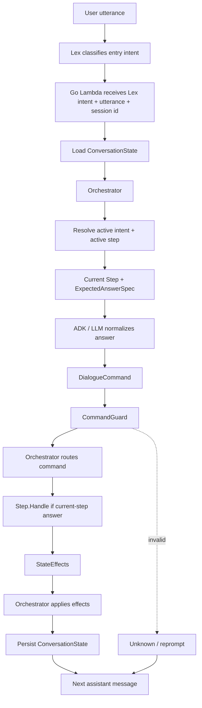
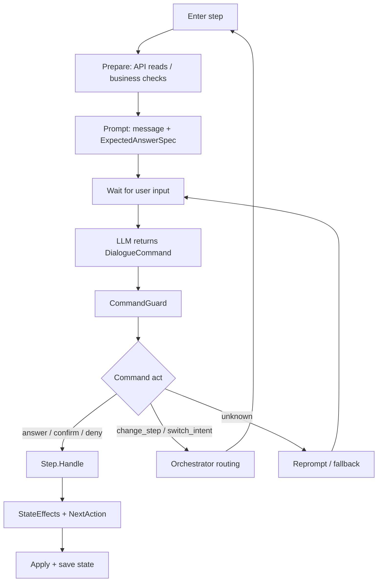
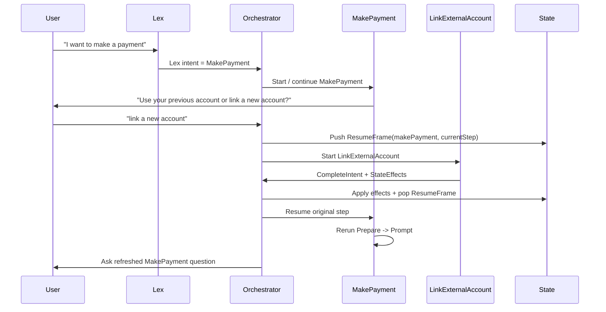
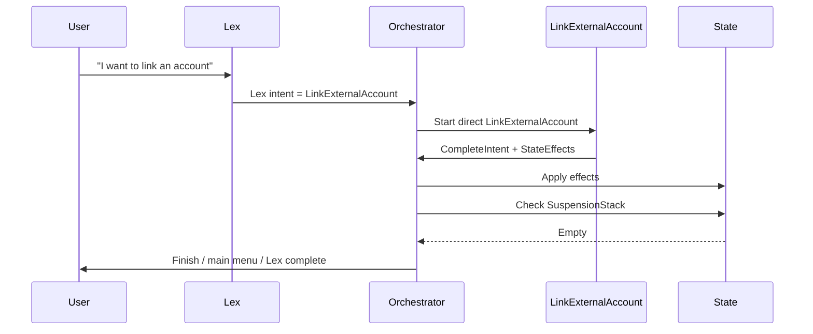
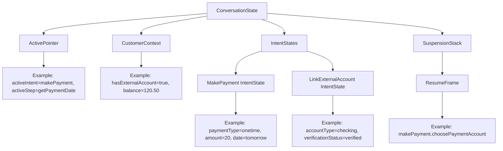
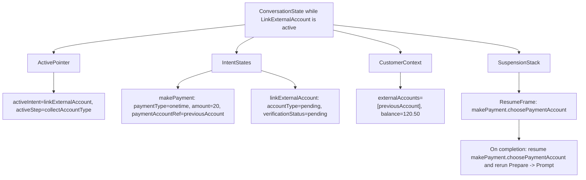
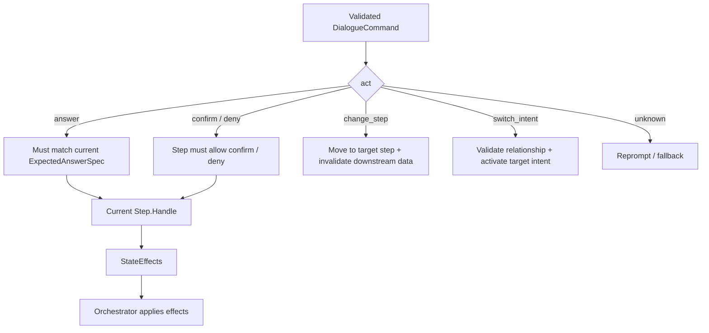
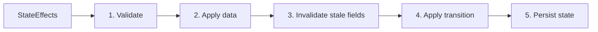

# Intent / Step Orchestration Demo

## Purpose

Small demo design for showing how a Go Lambda can manage multi-step intents after Lex has already classified the first intent.

Key idea:

```text
Lex classifies the entry intent.
LLM normalizes the user's answer into a DialogueCommand.
Go Orchestrator validates, routes, applies state changes, and resumes flows.
```

## Demo Scope

- Entry intent comes from Lex.
- Demo intents: `MakePayment` and `LinkExternalAccount`.
- Intents are same-level; one intent does not own another.
- `MakePayment` can route to `LinkExternalAccount`.
- Resume happens only when a `ResumeFrame` exists.
- On resume, return to the original intent and original step, then rerun `Prepare -> Prompt`.

## Diagram 1: Runtime Architecture



## Diagram 2: Step Lifecycle



## Diagram 3: MakePayment To LinkExternalAccount



## Diagram 4: Direct LinkExternalAccount



## Diagram 5: Conversation State



## Diagram 6: State While Linking Account



## Diagram 7: Command Routing



## Diagram 8: Effect Apply Order



## Minimal Rules

| Topic | Rule |
| --- | --- |
| Entry intent | Lex provides the first intent. |
| LLM | LLM only returns structured `DialogueCommand`. |
| Guard | `CommandGuard` validates before state mutation. |
| Step | Step returns `StateEffects`; it does not write state. |
| Orchestrator | Only Orchestrator applies effects and saves state. |
| Resume | Resume only if `ResumeFrame` exists. |
| Resume target | Return to original intent + original step. |
| Resume execution | Rerun `Prepare -> Prompt`. |

## Demo Scenarios

1. `MakePayment` happy path.
2. `MakePayment -> LinkExternalAccount -> resume MakePayment`.
3. Direct `LinkExternalAccount` completes without resuming `MakePayment`.
4. User changes amount/date/account after later steps; disclosure becomes stale.
5. User says `automatic pay`; LLM normalizes to `autopay`.
