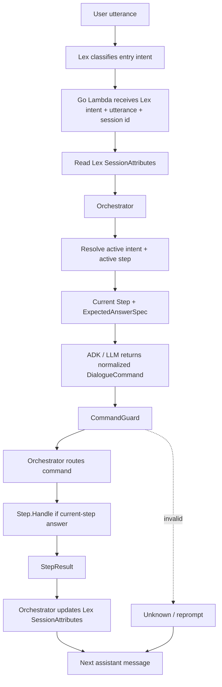
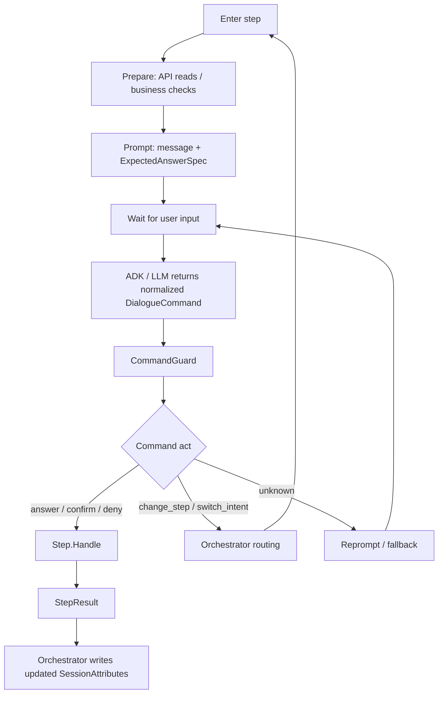
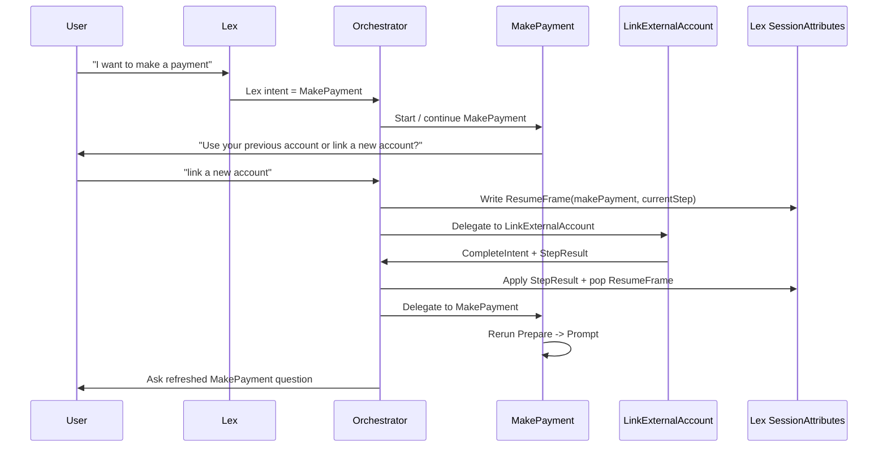
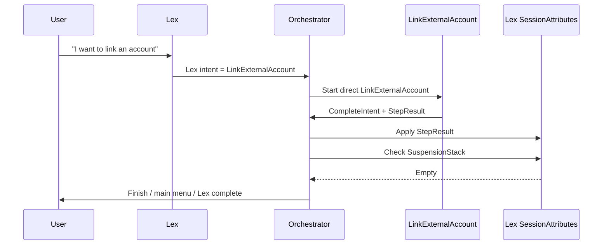
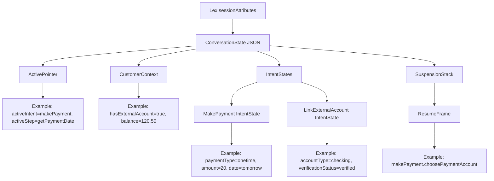
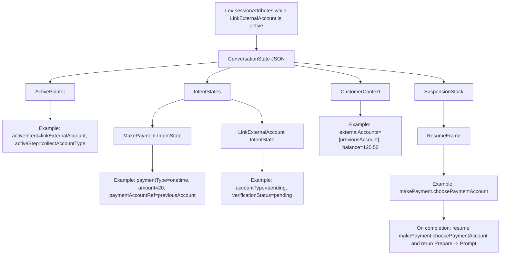
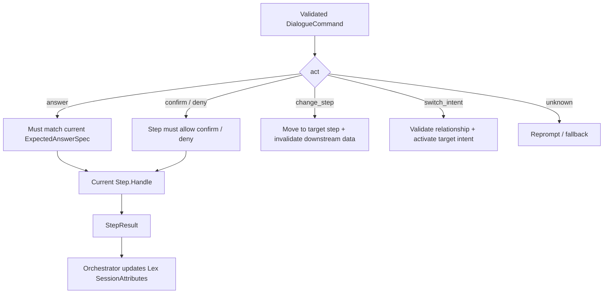
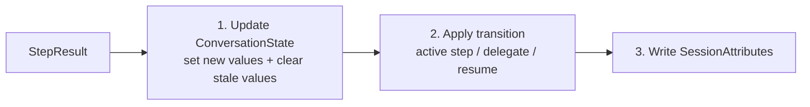

# Intent / Step Orchestration Demo

Note: this Markdown file renders well on GitHub. For a real Confluence page, use `2026-06-07-intent-step-orchestration-confluence-paste.html`: open it in a browser, copy the rendered page, then paste into Confluence.

## Purpose

Small demo design for showing how a Go Lambda can manage multi-step intents after Lex has already classified the first intent.

Key idea:

```text
Lex classifies the entry intent.
LLM normalizes the user's answer into a DialogueCommand.
Go Orchestrator reads Lex SessionAttributes, validates/routes, updates ConversationState, and writes updated SessionAttributes.
```

## Demo Scope

- Entry intent comes from Lex.
- Demo intents: `MakePayment` and `LinkExternalAccount`.
- Intents are same-level; one intent does not own another.
- `MakePayment` can route to `LinkExternalAccount`.
- Resume happens only when a `ResumeFrame` exists.
- On resume, return to the original intent and original step, then rerun `Prepare -> Prompt`.
- Demo `ConversationState` is stored in Lex `sessionAttributes`.

## Diagram 1: Runtime Architecture



## Diagram 2: Step Lifecycle



## Runtime Step Prompt Example

Example step:

| Field | Value |
| --- | --- |
| Intent | `MakePayment` |
| Step | `choosePaymentType` |
| Assistant question | "Do you want to make a one-time payment or set up auto pay?" |
| Expected answer | `paymentType = onetime | autopay` |

Prompt generated by the current Step:

```text
You are a dialogue command normalizer for a phone payment flow.

Your job is to convert the user's latest utterance into one structured DialogueCommand.

You are not the flow controller.
You do not decide business policy.
You do not update state.
You do not invent new intents, steps, slots, or values.

Current context:
- active_intent: MakePayment
- active_step: choosePaymentType
- last_assistant_question: "Do you want to make a one-time payment or set up auto pay?"

ExpectedAnswerSpec:
- allowed_acts:
  - answer
  - change_step
  - switch_intent
  - unknown

- if act = answer:
  - slot: paymentType
  - allowed_canonical_values:
    - onetime
    - autopay

Canonical value mapping examples:
- "one time", "one-time", "pay once", "single payment" => onetime
- "auto pay", "automatic payment", "recurring payment", "monthly automatic" => autopay

Allowed switch intents:
- LinkExternalAccount
  - description: User wants to link, add, or use a new external bank account before continuing payment.

Allowed change_step targets inside MakePayment:
- choosePaymentAccount
  - description: User wants to change which account/payment method to use.
- getPaymentAmount
  - description: User wants to change the payment amount.
- getPaymentDate
  - description: User wants to change the payment date.

Output contract:
Return exactly one DialogueCommand.

Valid command acts:
- answer
- confirm
- deny
- change_step
- switch_intent
- unknown

Rules:
1. If the user answers the current question, return act=answer with the canonical value.
2. If the user says "automatic payment", "recurring", or similar, normalize it to autopay.
3. If the user says "pay once" or similar, normalize it to onetime.
4. If the user wants to link a new account, return act=switch_intent and target_intent=LinkExternalAccount.
5. If the user wants to change an earlier payment field, return act=change_step with the target step.
6. If the utterance is unrelated, ambiguous, or unsafe to interpret, return act=unknown.
7. Do not include explanations.
8. Do not ask the user a question.
9. Do not include values outside the allowed canonical values.

Latest user utterance:
"{USER_UTTERANCE}"
```

Output example: user says "automatic payment".

```json
{
  "act": "answer",
  "intent": "MakePayment",
  "step": "choosePaymentType",
  "slot": "paymentType",
  "value": "autopay",
  "confidence": 0.92
}
```

Output example: user says "I want to link a new account".

```json
{
  "act": "switch_intent",
  "intent": "MakePayment",
  "step": "choosePaymentType",
  "target_intent": "LinkExternalAccount",
  "reason": "User wants to link a new external account before continuing payment.",
  "confidence": 0.9
}
```

Responsibility boundary:

| Component | Responsibility |
| --- | --- |
| Step | Generates the prompt context and `ExpectedAnswerSpec`. |
| ADK / LLM | Normalizes the user's utterance into one `DialogueCommand`. |
| CommandGuard | Validates command shape and canonical values. |
| Step.Handle | Runs business logic and returns `StepResult`. |
| Orchestrator | Updates Lex `SessionAttributes` and handles active step / delegate / resume. |

## Diagram 3: MakePayment To LinkExternalAccount



## Diagram 4: Direct LinkExternalAccount



## Diagram 5: ConversationState In SessionAttributes



## Diagram 6: SessionAttributes While Linking Account



## Diagram 7: Command Routing



## Diagram 8: StepResult Apply Order



## Minimal Rules

| Topic | Rule |
| --- | --- |
| Entry intent | Lex provides the first intent. |
| LLM | LLM only returns structured `DialogueCommand`. |
| Guard | `CommandGuard` validates command shape and canonical values against `ExpectedAnswerSpec`. |
| Step | Step owns business logic and returns `StepResult`; it does not write Lex SessionAttributes. |
| Orchestrator | Only Orchestrator updates Lex SessionAttributes from `StepResult` and handles active step / delegate / resume. |
| Storage | `ConversationState` lives inside Lex `sessionAttributes`. |
| Resume | Resume only if `ResumeFrame` exists. |
| Resume target | Return to original intent + original step. |
| Resume execution | Rerun `Prepare -> Prompt`. |

## Demo Scenarios

1. `MakePayment` happy path.
2. `MakePayment -> LinkExternalAccount -> resume MakePayment`.
3. Direct `LinkExternalAccount` completes without resuming `MakePayment`.
4. User changes amount/date/account after later steps; disclosure becomes stale.
5. User says `automatic pay`; LLM normalizes to `autopay`.
