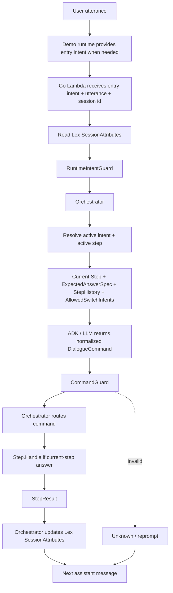
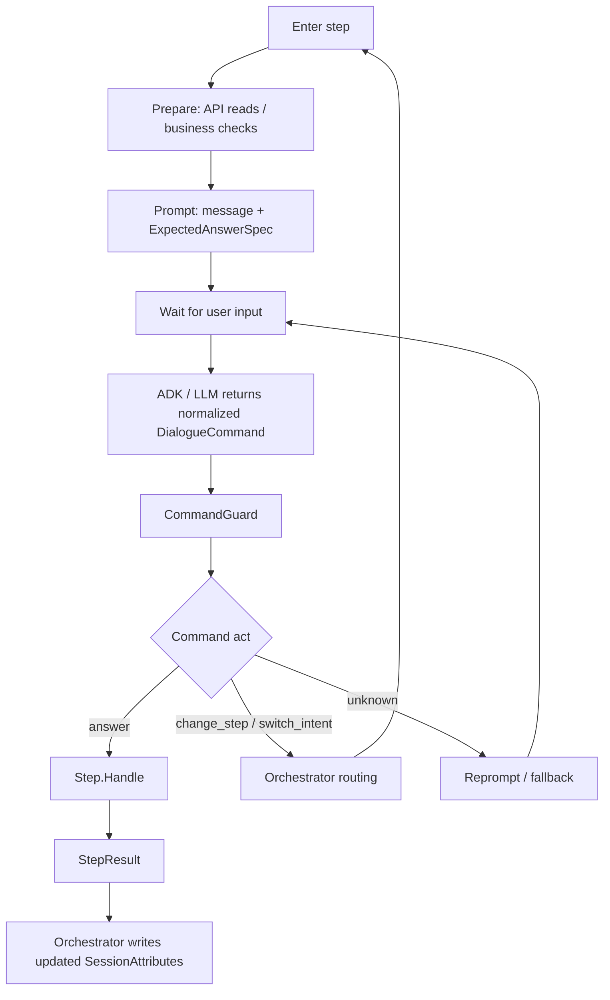
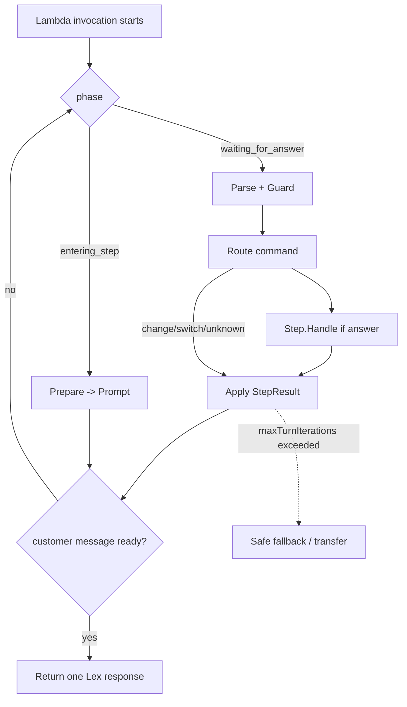
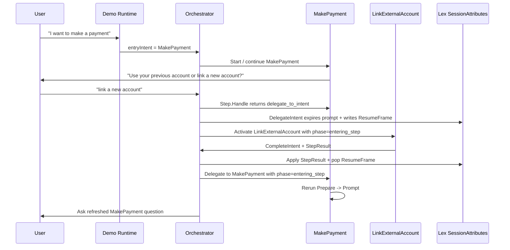
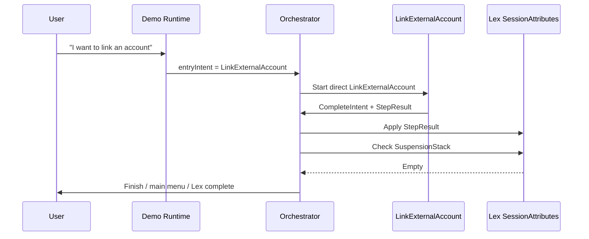
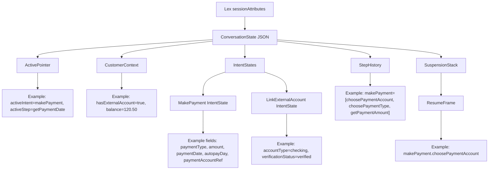
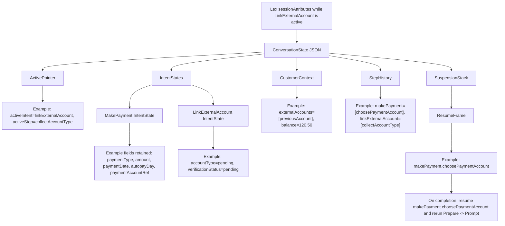
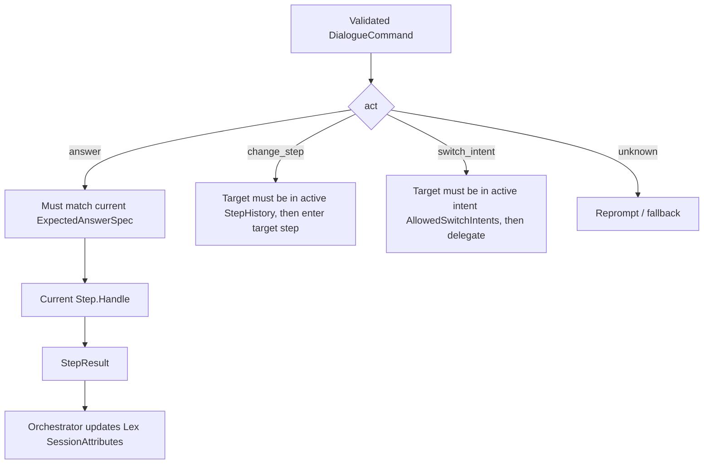
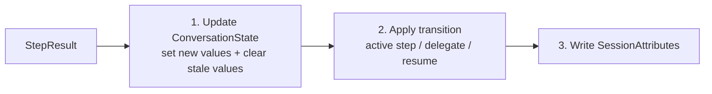

# Intent / Step Orchestration Demo

## Purpose

Small demo design for showing how a Go Lambda can manage multi-step intents after an entry intent has been provided by the demo runtime. Future Lex integration can provide that first entry intent, but the current demo does not depend on Lex.

Key idea:

```text
The demo runtime provides the entry intent only when no conversation is active.
Mid-flow incoming intent labels are ignored for routing once ConversationState.activeIntent exists.
LLM normalizes the user's answer into a DialogueCommand.
Go Orchestrator reads Lex SessionAttributes, validates/routes, updates ConversationState, and writes updated SessionAttributes.
```

## Demo Scope

- Entry intent comes from the demo runtime / CLI / test harness. Future Lex can provide the same entry intent.
- After `ConversationState.activeIntent` exists, `ConversationState` is the source of truth.
- Demo intents: `MakePayment` and `LinkExternalAccount`.
- Intents are same-level; one intent does not own another.
- `MakePayment` can route to `LinkExternalAccount`.
- Resume happens only when a `ResumeFrame` exists.
- On resume, return to the original intent and original step, then rerun `Prepare -> Prompt`.
- Demo `ConversationState` is stored in Lex `sessionAttributes`.

## Diagram 1: Runtime Architecture



Mid-flow rule: if `ConversationState.activeIntent` exists, `RuntimeIntentGuard` ignores conflicting incoming intent labels. Only `DialogueCommand.switch_intent` or `StepResult.delegate_to_intent` can change the active intent.

## Diagram 2: Step Lifecycle



## Diagram 2.5: One Lambda Turn



One Lambda invocation may move through several deterministic steps, but it returns at most one customer-facing message.

## Step Registry vs Step History

| Item | Used by | Purpose |
| --- | --- | --- |
| `StepRegistry` | Go only | Full map of all step implementations inside an intent. Used to resolve code and validate real step names. |
| `StepHistory` | Go + LLM prompt | Steps already executed / filled for the active intent. Used as the only `change_step` target list shown to the LLM. |
| `AllowedSwitchIntents` | Go + LLM prompt | Peer intents the active intent is allowed to delegate/switch to, with short descriptions. |

Rule: the LLM does not see all steps. It only sees current prompt expectations, already returnable steps, and allowed peer intents.

## Lex Slot vs Business Slot

| Concept | Example | Meaning |
| --- | --- | --- |
| Lex capture slot | `userUtterance` | Generic slot used to capture the caller's raw answer and send every turn back to Lambda. This can be the same for every prompt. |
| Internal business slot | `paymentType`, `paymentDate`, `autopayDay`, `disclosureAccepted` | Canonical field returned by ADK / LLM and validated by Go. This must be precise. |

Rule: one generic Lex slot is fine. Internal business slots still stay separate because Go validation, step handling, disclosure text, and stale-field invalidation depend on them.

## Runtime Step Prompt Example

Example step:

| Field | Value |
| --- | --- |
| Intent | `MakePayment` |
| Step | `choosePaymentType` |
| Assistant question | "Do you want to make a one-time payment or set up auto pay?" |
| Expected answer | `paymentType = onetime | autopay` |

Prompt generated by the current Step:

```text
You are a dialogue command normalizer for a phone payment flow.

Your job is to convert the user's latest utterance into one structured DialogueCommand.

You are not the flow controller.
You do not decide business policy.
You do not update state.
You do not invent new intents, steps, slots, or values.

Current context:
- active_intent: MakePayment
- active_step: choosePaymentType
- last_assistant_question: "Do you want to make a one-time payment or set up auto pay?"

ExpectedAnswerSpec:
- if act = answer:
  - slot: paymentType
  - allowed_canonical_values:
    - onetime
    - autopay

Canonical value mapping examples:
- "one time", "one-time", "pay once", "single payment" => onetime
- "auto pay", "automatic payment", "recurring payment", "monthly automatic" => autopay

Allowed switch intents:
- LinkExternalAccount
  - description: User wants to link, add, or use a new external bank account before continuing payment.

Returnable change_step targets already executed in active MakePayment history:
- choosePaymentAccount
  - description: User wants to change which account/payment method to use.

Do not infer or invent other MakePayment steps.
The full StepRegistry is code-only and is not provided to you.

Output contract:
Return exactly one DialogueCommand.

Valid command acts:
- answer
- change_step
- switch_intent
- unknown

Rules:
1. If the user answers the current question, return act=answer with the canonical value.
2. If the user says "automatic payment", "recurring", or similar, normalize it to autopay.
3. If the user says "pay once" or similar, normalize it to onetime.
4. If the user wants to link a new account, return act=switch_intent and target_intent=LinkExternalAccount.
5. If the user wants to change an earlier payment field, return act=change_step only when the target is listed in returnable_change_step targets.
6. If the utterance is unrelated, ambiguous, or unsafe to interpret, return act=unknown.
7. Yes/no is not a separate act. If this step expects yes/no, return act=answer with value=yes or value=no.
8. Do not include explanations.
9. Do not ask the user a question.
10. Do not include values outside the allowed canonical values.

Latest user utterance:
"{USER_UTTERANCE}"
```

Output example: user says "automatic payment".

```json
{
  "act": "answer",
  "intent": "MakePayment",
  "step": "choosePaymentType",
  "slot": "paymentType",
  "value": "autopay",
  "confidence": 0.92
}
```

Output example: user says "I want to link a new account".

```json
{
  "act": "switch_intent",
  "intent": "MakePayment",
  "step": "choosePaymentType",
  "target_intent": "LinkExternalAccount",
  "reason": "User wants to link a new external account before continuing payment.",
  "confidence": 0.9
}
```

Responsibility boundary:

| Component | Responsibility |
| --- | --- |
| Step | Generates the prompt context and `ExpectedAnswerSpec`. |
| ADK / LLM | Normalizes the user's utterance into one `DialogueCommand`. |
| CommandGuard | Validates command shape, canonical values, step history, and allowed switch intents. |
| Step.Handle | Runs business logic and returns `StepResult`. |
| Orchestrator | Updates Lex `SessionAttributes` and handles active step / delegate / resume. |

## Diagram 3: MakePayment To LinkExternalAccount



## Diagram 4: Direct LinkExternalAccount



## Diagram 5: ConversationState In SessionAttributes



## Diagram 6: SessionAttributes While Linking Account



## Diagram 7: Command Routing



## MakePayment Date Slots

| Payment type | Step | Slot | Canonical value |
| --- | --- | --- | --- |
| `onetime` | `getPaymentDate` | `paymentDate` | Full date, for example `2026-06-10` |
| `autopay` | `getAutopayDay` | `autopayDay` | Day of month, integer `1` through `31` |

Do not use one shared date slot for both branches. One-time payment and autopay have different disclosure wording, so they need different fields.

Also do not use one shared date step. `getPaymentDate` and `getAutopayDay` are two separate steps:

- `getPaymentDate.Handle` writes only `makePayment.paymentDate`.
- `getAutopayDay.Handle` writes only `makePayment.autopayDay`.

## Diagram 8: StepResult Apply Order



## Minimal Rules

| Topic | Rule |
| --- | --- |
| Entry intent | Demo runtime provides the first intent only when no active conversation exists. Future Lex can provide the same entry intent. |
| Runtime guard | If `ConversationState.activeIntent` exists, ignore conflicting incoming intent labels and keep routing through Orchestrator. |
| LLM | LLM only returns structured `DialogueCommand`. |
| Guard | `CommandGuard` validates command shape and canonical values against `ExpectedAnswerSpec`. |
| Yes/no | Yes/no is not a command act; it is an `answer` value only when the current step allows `yes` / `no`. |
| Step registry | Full `StepRegistry` is code-only; do not send all steps to the LLM. |
| Step history | LLM receives only already executed / returnable steps for the active intent. |
| Change step | `targetStep` must exist in both active intent `StepRegistry` and active intent `StepHistory`. |
| Switch intent | `targetIntent` must be listed in the active intent's allowed peer intent relationships. |
| Switch resume | During an active conversation, `switch_intent` defaults to `resumeBehavior=push_current_step`, so the original step resumes after the target intent completes. |
| Step | Step owns business logic and returns `StepResult`; it does not write Lex SessionAttributes. |
| Orchestrator | Only Orchestrator updates Lex SessionAttributes from `StepResult` and handles active step / delegate / resume. |
| Turn loop | One Lambda invocation loops until it has exactly one customer-facing message, completes, or transfers. |
| Loop guard | Stop the internal turn loop after `maxTurnIterations = 10` and use safe fallback / transfer. |
| Storage | `ConversationState` lives inside Lex `sessionAttributes`. |
| Phase | Persist only `entering_step` or `waiting_for_answer`; change/switch/resume always enters the target step as `entering_step`. |
| Retry | `retryCount` belongs to the current prompt. Increment on unknown/invalid/low confidence, max 3. Reset when step/intent/prompt identity changes; do not reset for same-prompt reprompt. |
| Resume | Resume only if `ResumeFrame` exists. |
| Resume target | Return to original intent + original step. |
| Resume execution | Rerun `Prepare -> Prompt`. |
| Change / switch | Current prompt expires; the target step enters with `phase=entering_step`. |

## Demo Scenarios

1. `MakePayment` happy path.
2. `MakePayment -> LinkExternalAccount -> resume MakePayment`.
3. Direct `LinkExternalAccount` completes without resuming `MakePayment`.
4. User changes amount/date/account after later steps; disclosure becomes stale.
5. User says `automatic pay`; LLM normalizes to `autopay`.
6. During disclosure, user says `sure`; LLM returns `act=answer`, `slot=disclosureAccepted`, `value=yes`.
7. During amount collection, user says `yes`; `CommandGuard` rejects it as `unknown`.
8. User changes step or switches intent; the old question expires and the target step runs `Prepare -> Prompt`.
9. A new incoming intent label conflicts mid-flow; `RuntimeIntentGuard` keeps the active intent from `ConversationState`.
10. LLM tries to jump to a step not in `StepHistory`; `CommandGuard` downgrades it to `unknown`.
